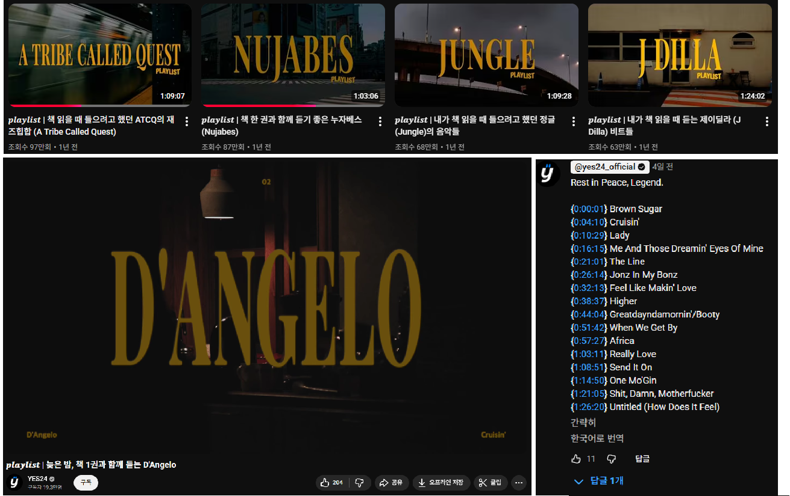
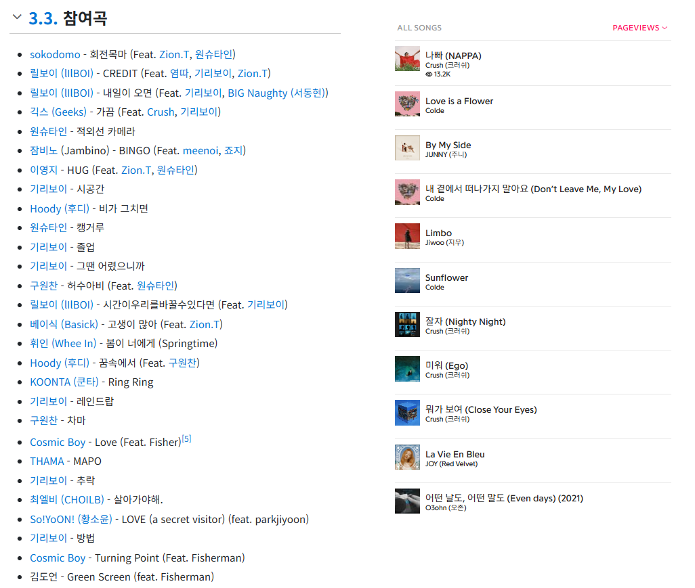
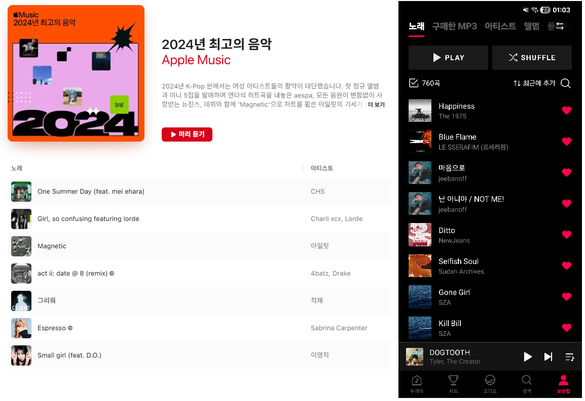

# 🎵 Groupify

> 이미지에서 음악을 추출하여 Spotify 플레이리스트로 만들어주는 서비스

 

## 📸 이럴 때 사용하세요

### 1. **타 스트리밍 플랫폼에서 플레이리스트 가져올 때**
- Apple Music, YouTube Music, Melon 등의 플레이리스트 스크린샷
- 다른 플랫폼의 큐레이션(ex.Apple Music 플레이리스트)을 Spotify로 바로 옮기기

 

### 2. **유튜브 플레이리스트 영상에서 곡들 한번에 가져오고 싶을 때**
- 유튜브 영상의 댓글이나 설명란에 정리된 트랙리스트
- "00:00 곡명 - 아티스트" 형식으로 나열된 타임라인
- 믹스셋, DJ 믹스, 컴필레이션 영상의 수록곡

 

### 3. **특정 아티스트/프로듀서/작사가/작곡가의 작업물을 한번에 가져오고 싶을 때**
- 나무위키, GENIUS 등, 정리되어 있는 작업물 목록을 확인
- 프로듀서,작사,작곡 참여곡은 Spotify에서 따로 모아보기 어려워 더 유용!

 

---

## 🚀 작동 방식

### **1. 이미지 업로드**
- 트랙리스트가 포함된 스크린샷 또는 이미지 파일 업로드
- 복사한 이미지 붙여넣기 (Ctrl+V) or 파일 직접 업로드

### **2. LLM을 통해 곡 정보 추출**
- OpenAI API가 이미지에서 곡 정보 추출
- Spotify API로 정확한 트랙 매칭

### **3. 플레이리스트 생성**
- 인식된 곡들을 확인하고 제거/추가 가능
- "SAVE AS PLAYLIST" 버튼으로 즉시 Spotify에 저장

 

---

## ✨ 주요 기능

### 📸 **이미지 기반 플레이리스트 생성**
- 드래그 앤 드롭 또는 클립보드 붙여넣기
- 여러 이미지 동시 업로드 가능
- 플레이리스트 생성 전 곡 리스트 미리보기
- 잘못 추출된 곡 제거 가능

### 🔍 **텍스트 검색으로 트랙 추가**
- 트랙명 + 아티스트 검색
- 검색 결과 미리보기 및 클릭으로 추가

### 🎯 **나만의 Top Tracks 플레이리스트**
- 최근 4주 / 6개월 / 1년 통계
- 가장 많이 들은 곡 & 아티스트 확인
- 원하는 개수만큼 선택하여 플레이리스트 생성

 

---

---

## 📝 사용 예시

### **예시 1: YouTube 믹스 영상**

유튜브 영상 설명란에 있는 트랙리스트를 캡쳐하여 업로드하세요.

→ 자동으로 곡 정보 인식 후 플레이리스트 생성!

 

### **예시 2: 나무위키 디스코그래피**

프로듀서나 아티스트의 작업물 목록 페이지를 캡쳐하세요.

→ 프로듀서의 전체 작업물이 한 번에 플레이리스트로!

 

### **예시 3: Apple Music 플레이리스트**

다른 스트리밍 플랫폼의 플레이리스트를 Spotify로 옮기세요.

→ 동일한 곡들이 Spotify 플레이리스트로 생성됨

 

---

## 💡 팁

- **이미지 품질**: 글자가 선명할수록 인식률이 높아집니다
- **한 번에 여러 이미지**: 여러 페이지 스크린샷을 한번에 업로드하면 자동으로 합쳐집니다
- **수동 추가/제거**: 인식이 잘못되었거나 추가하고 싶은 곡은 수동으로 조정 가능
- **중복 제거**: 자동으로 중복 트랙을 제거합니다

 

---

## 🎨 스크린샷

### 메인 화면 - 이미지 업로드

### 통계 화면 - Top Tracks

 

---

---

---

